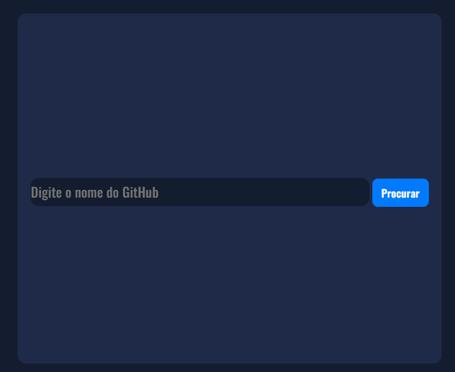
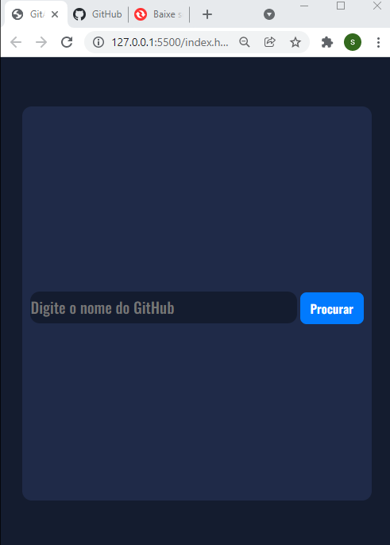

## GITHUB SEARCH

## Feito para treinar coisas relacionados a API

#
<a href="https://confident-spence-4c6baf.netlify.app/">Site</a>

## O que aparece:
- [x] Nome
- [x] Cidade
- [x] Seguidores
- [x] Repositórios
- [x] URL perfil/repositórios

# VIDEO

# IMAGENS:

